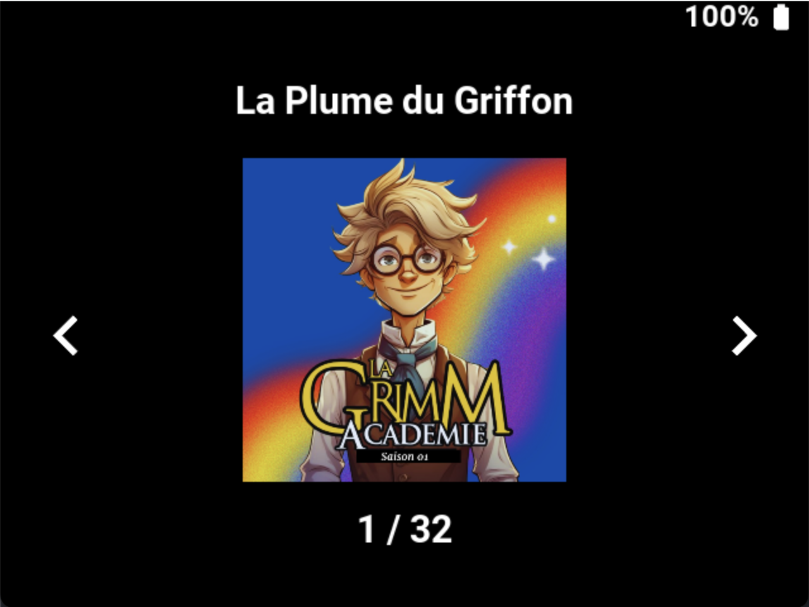

# Storii

## Presentation

A children-friendly MP3 player for the Miyoo Mini (+).


## Installation

### Requirements

You'll need to have [Onion OS](https://onionui.github.io/) installed on your SD Card.

### Setup

* Download the latest release of storii [here](https://github.com/pcorbel/storii/releases).
* Extract the archive and copy the `App` directory to the root of your SD card.
* Merge it if need be


### Storiies

* On your SD card, in the `/Media` directory, create a `Storiies` directory.
* In `Storiies`, create a directory for each album you want to add.
* In each album directory, add the tracks.
* [Optional] You can add a cover image. The cover image must be named `cover.png`.

```bash
/Media/Storiies
├── Album A
│   ├── Track 1.mp3
│   ├── ...
│   ├── Track 3.mp3
│   └── cover.png
├── Album B
│   ├── Track 1.mp3
│   ├── ...
│   ├── Track 5.mp3
│   └── cover.png
└── Album C
│   ├── Track 1.mp3
│   ├── ...
│   ├── Track 8.mp3
    └── cover.png
```

## Usage

### Storiies menu


| Buttons      | Action                    |
|--------------|---------------------------|
| `←/→`        | Paginate through storiies |
| `A`          | Select current storii     |

### Chapters menu



| Buttons      | Action                    |
|--------------|---------------------------|
| `←/→`        | Paginate through chapters |
| `A`          | Select current chapter    |
| `B`          | Go back to Storiies menu  |

### Player menu


| Buttons      | Action                           |
|--------------|----------------------------------|
| `←/→`        | Rewind / Fast-Forward 10 seconds |
| `A`          | Play / Pause                     |
| `B`          | Go back to Chapters menu         |

## Advanced

### Konami Menu

An hidden, parent-oriented, menu can be accessed by entering the Konami code: `↑ ↑ ↓ ↓ ← → ← → B A`.


| Buttons      | Action                           |
|--------------|----------------------------------|
| `↑/↓`        | Navigate through menu options    |
| `←/→`        | Adjust values for selected option|
| `A`          | Select current option            |
| `B`          | Exit the Konami menu             |

#### Konami Menu Options

1. **Set Timer**: Allows you to set a timer for how long the player will run.
2. **Launch at Startup**: Toggle whether Storii should launch automatically when the Miyoo Mini (+) starts up.
3. **Quit Storii**: Exits the Storii application and returns to the Onion OS menu.
